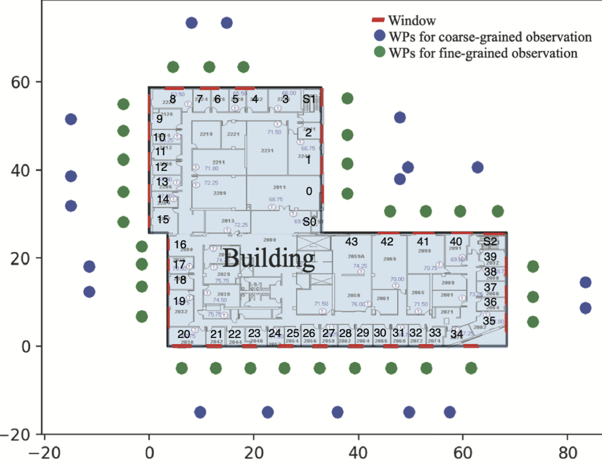

# Drone_SRDS

## 1. Create Building Model
 
### 1). Building structure file. --> we use the DBH building as an example (see file: data/dbh_stu.csv). 

```
x y width hight floor f_h win_below win_h fac angle clock nom
0 58.58 32.86 32.86 12 3 1.1 1.8 1,2,3 0,90,180 1,-1,-1 1/0/0,0/1/0,-1/0/0
3.53 25.72 64.85 25.72 12 3 1.1 1.8 4,5,6,7 180,270,0,90 -1,1,1,-1 -1/0/0,0/-1/0,1/0/0,0/1/0
```
DHB contains rectangles. Here we describe each rectangle by specifying: 1) x, y is the coordinate of the left lower endpoint, 2) 'width' and 'height' of the rectangle, 3) floor indicates the number of floors, 4) win_below is the gap between the window bottom and the floor, 5) win_h is the height of the window, 6) fac: DBH has 7 facades, 'fac'=1,2,3 means this rectangle contains facades 1,2,3, 7) angle indicates the direction of each facade, 8) nom give the direction vector of each facade, where 1/0/0 denotes vector (1,0,0).

### 2) 
